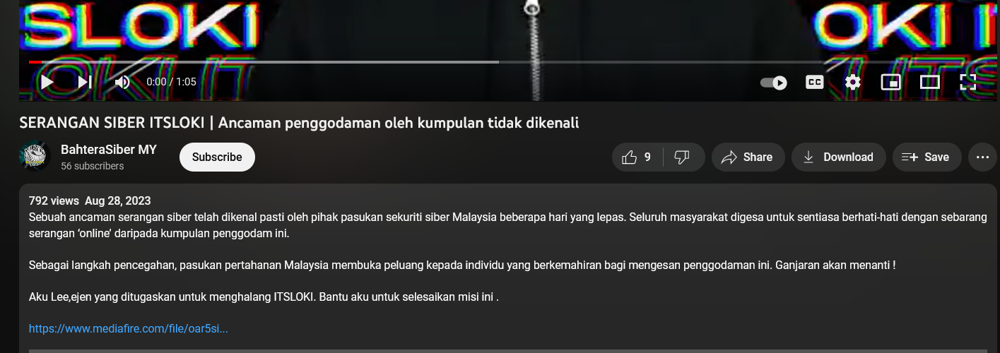
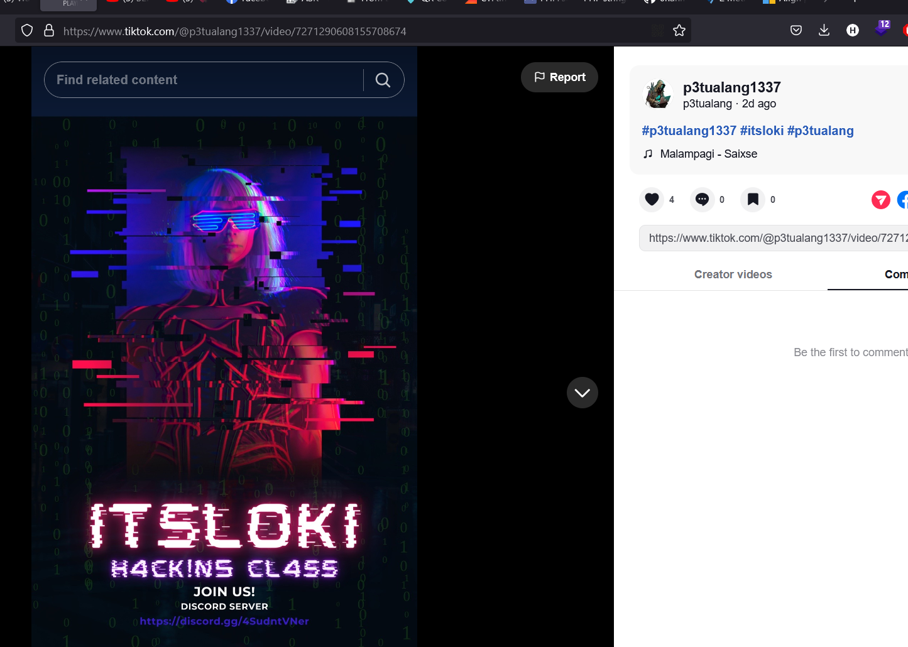
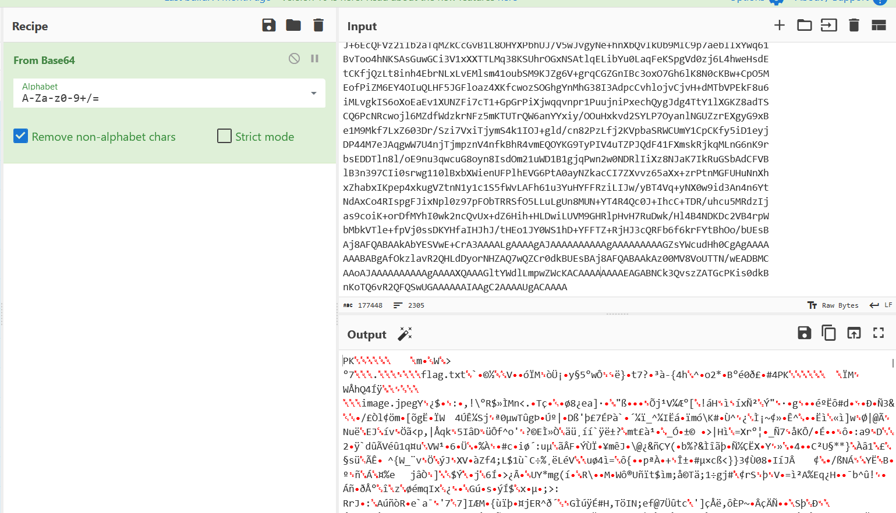
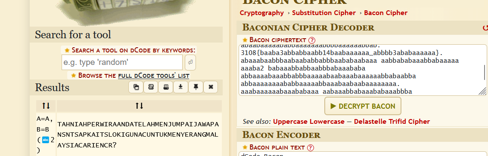

# Pico CTF 2021 Writeups

 (1).png>)

 (1).png>)

## **W**eb Exploitation

### Ancient History

.png>)

We were given a website

.png>)

After viewing the source

.png>)

Found the flag amongst the obfuscated code. **picoCTF{th4ts\_k1nd4\_n34t\_3bed1170}**

### GET aHEAD


We were given a website


Based on the challenge title, we should try get the website header either using curl or Burpsuite. curl command : `curl -X HEAD -i` [`http://mercury.picoctf.net:47967/`](http://mercury.picoctf.net:47967)\`\`

 (1).png>)

and we got the flag from the header. **picoCTF{r3j3ct\_th3\_du4l1ty\_cca66bd3}**

### Cookies

 (1).png>)

 (1).png>)

The title and hint of the website talks about cookies, lets view the cookies using the in browser function.

 (1).png>)

The current cookie value is -1, lets try changing it to 1and see if we get any output.

 (1).png>)

Based on the output, we need to traverse and try different value of cookies to get the flag.

 (1).png>)

And we got the flag on the 18 cookies. **picoCTF{3v3ry1\_l0v3s\_c00k135\_064663be}**

### Scavenger Hunt

 (1).png>)

.png>)

Seems like a normal html website, lets take a look at the source.

 (1).png>)

It seems that this is a directory traversing challenge, we got the first part picoCTF{t from the source. It says the website was made from html,css and js. Lets take a look at those.

 (1).png>)

Second part: h4ts\_4\_10

 (1).png>)

We found a js script, lets open it.

 (1).png>)

From the hint, we can guess the next part is in robots.txt that is used to configure crawler from accessing certain directory of the website.

 (1).png>)

3rd part: t\_0f\_pl4c

 (1).png>)

4th part: 3s\_2\_100k

 (1).png>)

5th part: \_f7ce8828} . flag: **picoCTF{th4ts\_4\_10t\_0f\_pl4c3s\_2\_100k\_f7ce8828}**

### Who are you?

 (1).png>)

 (1).png>)

Opening the website told us that we can only access it with picobrowser. From reading past writeup, it seems that we need to change the user agent to access it. We use the curl command : `curl -A "PicoBrowser" http://mercury.picoctf.net:46199` to change the user agent.

 (1).png>)

From the website, it asks us to visit the website, from the website itself. We can use curl command : `curl -A "PicoBrowser" http://mercury.picoctf.net:46199/ -H "Referer: http://mercury.picoctf.net:46199"`

 (1).png>)

Next it asks us to access the website from 2018. We can modify the time header through: `curl -A "PicoBrowser" http://mercury.picoctf.net:46199/ -H "Referer: http://mercury.picoctf.net:46199" -H "Date: Wed 17 Mar 2018 02:47:59 GMT"`

 (1).png>)

Now it asks us to send request without being tracked. We can use the DNT(Do Not Track) header curl command: `curl -A "PicoBrowser" http://mercury.picoctf.net:46199/ -H "Referer: http://mercury.picoctf.net:46199" -H "Date: Wed 17 Mar 2018 02:47:59 GMT" -H "DNT: 1"`

 (1).png>)

Now it only allows people from Sweden. We just need to use a sweden ip and X-Forwarded-For header to foward our curl request ip. `curl -A "PicoBrowser" http://mercury.picoctf.net:46199/ -H "Referer: http://mercury.picoctf.net:46199" -H "Date: Wed 17 Mar 2018 02:47:59 GMT" -H "DNT: 1" -H "X-Forwarded-For:193.150.233.115"`

 (1).png>)

Now it also want us to speak in Sweden. We just need to change the language header using the syntax: `curl -A "PicoBrowser" http://mercury.picoctf.net:46199/ -H "Referer: http://mercury.picoctf.net:46199" -H "Date: Wed 17 Mar 2018 02:47:59 GMT" -H "DNT: 1" -H "X-Forwarded-For:193.150.233.115" -H 'Accept-LAnguage: sv'`

 (1).png>)

And we finally got the flag. **picoCTF{http\_h34d3rs\_v3ry\_c0Ol\_much\_w0w\_8d5d8d77}**

### Some Assembly Required 1

.png>)

 (1).png>)

This challenge is straight forward. We just need to look for the wasm files in the debugger browser function to get the flag. **picoCTF{8857462f9e30faae4d037e5e25fee1ce}**

### It is my birthday

.png>)

This challenge is about the md5 hash collision that makes it unsecure.

 (1).png>)

The website requires us to upload two different pdf files with the same hashes. It also has an upload limit not allowing for more than 100kbs files. By using this [website](https://www.mscs.dal.ca/\~selinger/md5collision/), we got two exe program with md5 hash collision.

 (1).png>)

Now since the php script only requires the uploaded files to have .pdf extension, we can just rename the files and add .pdf before uploading it.

 (1).png>)

 (1).png>)

And we got the flag. **picoCTF{c0ngr4ts\_u\_r\_1nv1t3d\_73b0c8ad}**

### Most cookies

 (1).png>)

This challenge is about cookie forging. We were given a website and the server source code.

 (1).png>)

From the challenge description, we know that the website uses flask cookies. Flask cookie was made by using a 'secret key' to ensure it's secure. Let's see the value of the cookie using [flask-unsign](https://github.com/Paradoxis/Flask-Unsign).

 (1).png>)

Here we can see that the value is blank. However from the source code server.py, we can see that in order to get the flag, we need to set it to admin.

 (1).png>)

Before continue to forge it, we need to find the secret key of the flask cookie.

 (1).png>)

Here we can see that the secret key is chosen randomly from a list. We can bruteforce the wordlist by using [`flask-unsign`](https://github.com/Paradoxis/Flask-Unsign) feature.

.png>)

 (1).png>)

From the bruteforce, we found out the secret key is butter. Now we can forge a new cookie with value:admin and secret key: butter.

.png>)

Now change the cookie value on the browser to get the flag.

.png>)

flag: **picoCTF{pwn\_4ll\_th3\_cook1E5\_743c20eb}**

## Cryptography

### Pixelated


For this challenge we were given two images that seems to be made out of statics.


I treated this challenge as steganography and used [StegSolve](https://github.com/eugenekolo/sec-tools/tree/master/stego/stegsolve) to combine both images to produce an output.


After combining both and using the ADD function we can see the flag **picoCTF{0542dc1d).**

### Mod 26

 (1).png>)

It's a simple rot13 encryption. Let's use [CyberChef](https://gchq.github.io/CyberChef/#recipe=ROT13\(true,true,false,13\)\&input=Y3ZwYlBHU3thcmtnX2d2enJfVid5eV9nZWxfMl9lYmhhcWZfYnNfZWJnMTNfR1lwWE9IcVh9) to decrypt it.

 (1).png>)

flag: **picoCTF{next\_time\_I'll\_try\_2\_rounds\_of\_rot13\_TLcKBUdK}**

### Mind you Ps and Qs

.png>)

It's is the usual RSA challenge.

 (1).png>)

We have to decrypt it based on the value given. I'm not good at math and just use[ rsactftool](https://github.com/Ganapati/RsaCtfTool) to decrypt it.

 (1).png>)

flag: **picoCTF{sma11\_N\_n0\_g0od\_23540368}**

### Dacshund Attacks

 (1).png>)

.png>)

In this challenge we were given e,n and c value. The d value can be calculated by yourself. Based on the challenge we know that d has a small value meaning it is vulnerable to the[ wiener attack](https://en.wikipedia.org/wiki/Wiener's\_attack). We can use rsactftool again to decrypt it.

 (1).png>)

Flag: **picoCTF{proving\_wiener\_1146084}**

### Play Nice

 (1).png>)

 (1).png>)

This is just a playfair cipher. We can use [https://www.dcode.fr/playfair-cipher](https://www.dcode.fr/playfair-cipher) to decrypt it.

 (1).png>)

Enter the plaintext into netcat.

 (1).png>)

flag: **picoCTF{2e71b99fd3d07af3808f8dff2652ae0e}**

## Reverse Engineering

### Transformation

 (1).png>)

 (1).png>)

Opening the file, it looks some kind of unicode characters. I proceed to use [CyberChef](https://gchq.github.io/CyberChef) magic feature to see if it can decrypt it. By putting picoCTF in the crib, we were able to decode it.

 (1).png>)

**picoCTF{16\_bits\_inst34d\_of\_8\_26684c20}**

### keygenme-py

.png>)

 (1).png>)

Looking at the source code, we only need to find the key\_part\_dynamic\_1trial part of the flag.

.png>)

Looking at the source, we can see that the dynamic key is taken from the certain value of hexdigest of the username which is GOUGH. We can write a short python script to print it.

 (1).png>)

The full flag: **picoCTF{1n7h3|<3y\_of\_f911a486}**

### crackme

.png>)

.png>)

From the source code, we can see the the program uses ROT47 to encode and decode their bezos\_cc\_secret. We can use [CyberChef](https://gchq.github.io/CyberChef) to decode it.

.png>)

Flag: **picoCTF{1|\\/|\_4\_p34||ut\_4593da8a}.**

### speeds and feeds

.png>)

Lets use netcat and save the output.

.png>)

 (1).png>)

From the hint, we know that it is from[ CNC machine](https://www.steckermachine.com/blog/g-code-m-code) which uses G-code as the programming language. After some googling, I found this [https://ncviewer.com/](https://ncviewer.com) which can be used to plot the G-code language.

 (1).png>)

flag: **picoCTF{num3r1cal\_c0ntr0l\_f3fea95b}.**

### Shop

 (1).png>)

 (1).png>)

In this challenge, we have to exploit the fact that there the programmer did not implement any edge cases in the coin system of the market. We can input any value into the coin such as negative to exploit it.

 (1).png>)

The flag is encrypted with ascii. Decode it using [https://convert.town/ascii-to-text](https://convert.town/ascii-to-text).

 (1).png>)

Flag: **picoCTF{b4d\_brogrammer\_797b292c}**.

## Forensics

### Information

.png>)

In this challenge we were given an image and the hint says something regarding information.


So I just try to see the metadata of the image using exiftool.

.png>)

Looking at the license data, it looks like a base 64 string. Lets try decrypting it with [CyberChef](https://gchq.github.io/CyberChef).

.png>)

And we got the flag **picoCTF{the\_m3tadatais\_modified}.**

### Weird File


In this challenge we were given a Word document with a hint that there are some shell or macro in the file.

.png>)

We're also given a youtube [video ](https://www.youtube.com/watch?v=Y7IJjnLGqTQ)that talks about macros in docx file. In the video it shows that we can use[ olevba](https://github.com/decalage2/oletools/wiki/olevba) to extract macros source code from word and ppt files.

.png>)

From the extracted macros source, we can see that the embedded script is trying to print a line of strings that seems to be encoded in base 64.

```
$ echo cGljb0NURnttNGNyMHNfcl9kNG5nM3IwdXN9 | base64 -d                                                        1 ⨯
picoCTF{m4cr0s_r_d4ng3r0us}                                                                                                                     
```

After decoding it, we got the flag **picoCTF{m4cr0s\_r\_d4ng3r0us}**.

### Matryoshka doll

.png>)

This is matryoshka doll challenge in which we have to extract data from image multiple times to get the flag.

.jpg)

So lets binwalk the image to extract the data a couple times.

.png>)

After a couple times we got the flag.

.png>)

**picoCTF{336cfd51c9d9774fd37196c1d7320ff}.**

### Wireshark doo dooo do doo...

.png>)

In this challenge we were given a pcap file, lets open it with wireshark.

.png>)

I didnt find anything by trying to follow the packet so next I try to export the objects from the pcap.

.png>)

Then, I tried opening some of the files and found a string that seems like it has been encoded with Caesar Cipher.

 (1).png>)

So we can try decoding it either using some website such as [dcode.fr ](https://www.dcode.fr)or using python script from [github](https://github.com/rhamaa/Caesar-Cipher-Brute-Force/blob/master/caesar\_brute.py):

 (1).png>)

The flag is **picoCTF{p33kab00\_**_**1\_s33\_u\_deadbeef}**._

### Macrohard WeakEdge


At first I thought this challenge was similar to weird file and tried to extract macro data from the file using olevba, however I didnt manage to get any useable output from it.

.png>)

Then I remembered that ppt files are just made up from a bunch of files. I performed binwalk on it to extract the data.

.png>)

And after scouring around in the files, I manages to get a string that looks like it has been encoded.

.png>)

Since caesar cipher didn't work, I just put the strings into CyberChef and it automatically detected that it was from base64 and got the flag.

.png>)

flag: **picoCTF{D1d\_u\_kn0w\_ppts\_r\_z1p5}**

### Trivial Flag Transfer Protocol

.png>)

In this challenge we have to work with a pcap file. The title says something about ftp. As usual lets try opening it in wireshark and export the ftp objects from the pcap.

.png>)

We manages to get 2 strings files and 3 pictures.

 (1).png>)

Seems like it is encoded with caesar cipher. After decoding it, the instruction says:

> TFTPDOESNTENCRYPTOURTRAFFICSOWEMUSTDISGUISEOURFLAGTRANSFER.FIGUREOUTAWAYTOHIDETHEFLAGANDIWILLCHECKBACKFORTHEPLAN

and the plan:

> IUSEDTHEPROGRAMANDHIDITWITH-DUEDILIGENCE.CHECKOUTTHEPHOTOS

After that, lets open the program.deb

.png>)

It seems that one of the image contains a hidden flag and they used [steghide](https://github.com/StefanoDeVuono/steghide) to hid it with the key:DUEDILIGENCE.

.png>)

After trying steghide on all 3 pictures, we finally get an output on the third image.

 (1).png>)

flag: **picoCTF{h1dd3n\_1n\_pLa1n\_51GHT\_18375919}**

### Wireshark two twooo two twoo ..

 (1).png>)

This challenge was quite guessy and time consuming. We were given a pcap file. However after trying the usual follow packets and export objects, I only found fake flags. I saw someone mentions using NetworkMiner in the discord server and tried it.



After some times of taking a look at how it categorize each packets, I noticed something weird at the server and ip ttl value of some packets.



I then tried following one of the packets and it gave a website: [http://reddshrimpandherring.com/](http://reddshrimpandherring.com) brought me to a website that give something like a flag.



However after decoding it to base64 and submitting, it seems that it was a fake flag such as suggested by the site name itself.


Then I take a look back at the packets and notice that before the website, each of the packets have a different strings that looks like a base64 encoded strings. I then tried to decode one of the strings.


And indeed it produce part of the flag.



After collecting all of the strings from the packets, we got the flag. **picoCTF{dns\_3xf1l\_ftw\_deadbeef}.**

### Disk, Disk sleuth! II


The challenge gave us an image that can be mounted with a hint that the flag is stored a file called 'down-at-the-bottom.txt'. Rather than using sleuthkit as suggested, I just use binwalk to extract all the files in the image and find the file with the flag manually.


Manages to found the flag file in the root directory. The flag is **picoCTF{f0r3ns1c4t0rn0v1c30ba8d02d}.**

### Milkslap

.png>)

This was rather a stego challenge. We were given a link to a website and it looks like a script has been made to produce an output of gif from several images.

.png>)

After saving the image, I started performing the usual ctf tools: strings, stegsolve, binwalk and view hex. And then after using [zsteg](https://github.com/zed-0xff/zsteg), we manages to get output of the flag from one of the lsb.

.png>)

The flag is **picoCTF{imag3\_m4n1pul4t10n\_sl4p5}.**

### tunn3l v1s1on

.png>)

This was rather a quite hard and guessy challenge for me. In this challenge we were give a file. After looking at the header I was able to determine that it was a .bmp image.

.png>)

I then proceed to try opening the image using image magick display since windows program was unable to open it directly.

.png>)

From the displayed image, we can guess that this image hex value has been altered and not showing the whole picture.

 (1).png>)

After some times of reading the bitmap information from this[ website](http://www.ece.ualberta.ca/\~elliott/ee552/studentAppNotes/2003\_w/misc/bmp\_file\_format/bmp\_file\_format.htm), I started to try and change the hex value of the image. After several days of break and taking a look back, I was able to produce the full image though the colors are not fully correct by changing these offset: 00Ah, 0012h and 0016h.

.png>)

And the image we got is:


The flag is: **picoCTF{qu1t3\_a\_v13w\_2020}.** This challenge taught me a lot about bitmap and how it was actually structured, I do think it deserve more points than most of the forensic challenges.

## General Skills

### Obedient Cat

 (1).png>)

As the challenge name suggest, just use the cat syntax on the flag file.

 (1).png>)

flag: **picoCTF{s4n1ty\_v3r1f13d\_28e8376d}**

### Python Wrangling

 (1).png>)

Download the files, and use python to open them: `python3 ende.py -d flag.txt.en`

.png>)

### Wave a flag

.png>)

 (1).png>)

It's an executable program, lets change the permision and run it.

 (1).png>)

Flag: picoCTF{b1scu1ts\_4nd\_gr4vy\_18788aaa}

### Nice netcat...

 (1).png>)

Use netcat on terminal.

 (1).png>)

It gives numbers as output, let save it into txt.

 (1).png>)

Based on the hint, it's from ascii, lets decode it to text with this [website](https://convert.town/ascii-to-text).

.png>)

Flag: **picoCTF{g00d\_k1tty!\_n1c3\_k1tty!\_d3dfd6df}**

### Static ain't always noise

 (1).png>)

The static is an exe program, change the permission and run it.

 (1).png>)

Lets see the other file ltdis.sh

 (1).png>)

It seems that this bash script is similar to `objdump` that is used to disassemble elf 64 files.

.png>)

Using `objdump -s` option, gave us the flag.

.png>)

**picoCTF{d15a5m\_t34s3r\_ccb2b43e}.**

### Tab, Tab, Attack

 (1).png>)

Lets unzip it.

 (1).png>)

Lets use `cat` syntax to open the unzipped file.

 (1).png>)

flag: **picoCTF{l3v3l\_up!\_t4k18c}.**

### Magikarp Ground Mission

.png>)

Lets connect to the ssh with the given credentials.

 (1).png>)

This challenge just taught us to use the basic `ls` and `cd` command in the terminal.



 (1).png>)

flag: **picoCTF{xxsh\_0ut0f\\/\\/4t3r\_21cac893}**

## Binary Exploitation

### What's your input?

 (1).png>)

Based on the hint lets see the python version of the file.

 (1).png>)

It was created with python2 which has vulnerability in the input() function. This is the main reason why people have converted to python3. We can exploit it using `import('os').system("put command here")` in the input.

 (1).png>)

flag: **picoCTF{v4lua4bl3\_1npu7\_8433797}**

### Binary Gauntlet 0

 (1).png>)

### Stonks

.png>)

## Conclusion

Overall I really enjoyed the ctf. As a solo player, I was able to learn a lot of things especially in reverse engineering and bin exp. Hopefully I will be able to solve more challenge in the upcoming CTFs.
