# Hack@10 2021 Writeup

****

**GROUP: Sheesh**

**Team Members:** [**asylumdx**](https://twitter.com/asylumdx)**(me),** [**4fqm5**](https://twitter.com/4fqm5)**,** [**ghostinewires\_**](https://twitter.com/ghostinwires\_)****

****

****

### OSINT 

**1.1 101**

Going to [Programming Club Uniten Instagram](https://www.instagram.com/unitenproc/), we can see a string at the top.

924<\`\_LbKA+0=b>\_?0dBFbbKJN .

Input the string on [Cyberchef](https://gchq.github.io/CyberChef/) to decode it using ROT47

And yeah we got the flag! Ez! **hack10{3zpZ\_l3m0n\_5qu33zy}**

### Misc 

**2.1 cheesecake**

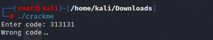

At first we try to find hidden sheet, which is Sheet 2 and 3 but

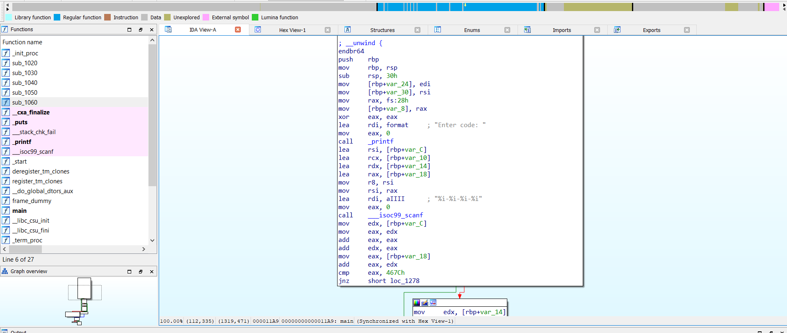

That is not the flag :( so we proceed with trying to extract the data from the xlsx file since we know that xlsx is just a [zip compressed file](https://www.lifewire.com/what-is-an-xlsx-file-2622540). We can do this with the binwalk command _binwalk --_dd='.\*' file.

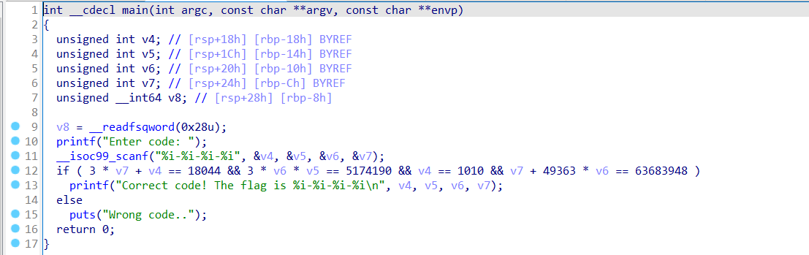

Then proceed to unzip the remaining files.

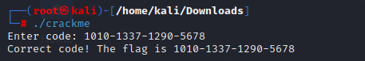

After that, we can try to grep the strings on the directory with the flag format by using command grep -R 'string' dir/ . Although we can only grep the fake flag, we also see a base64 text in the one of the file from the directory.

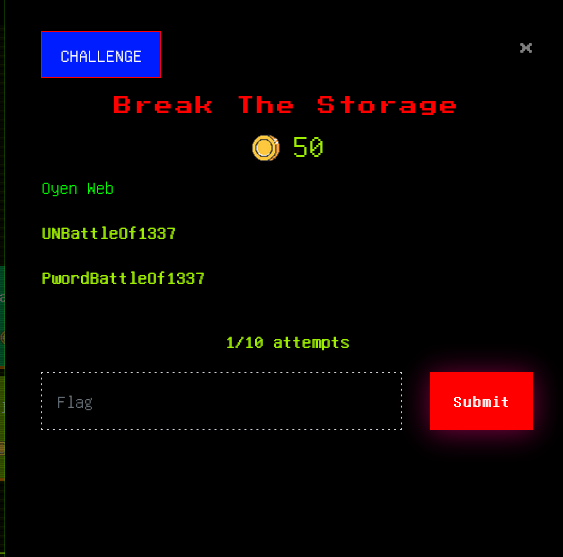

Decode the string from base 64 and we get the flag.

**hack10{4h\_lov3ly\_ch33s3c4k3}**

**2.2 power enough?**

**😤🤟** First blood! Sheeesh!

I am not sure if this is the intended solution but after downloading the[ powerflag.pttm](https://drive.google.com/file/d/1PTfiDF5iGtuDXbJ7\_wJHRTJv6BiEqzTb/edit) file. We treated this challenge the same as the cheesecake challenge. Proceed to extract data from the file with _binwalk --_dd='.\*' file

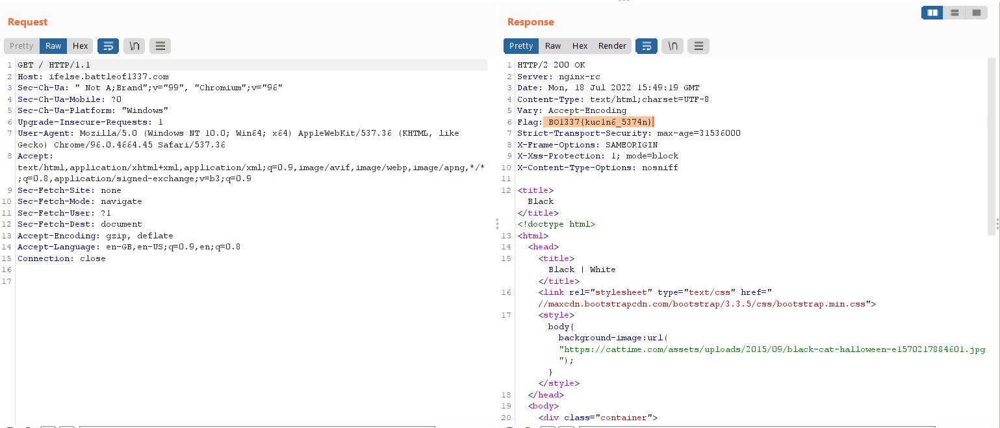

After unzipping the remaining file, we can see lots of images in one of the folders.

From image60.png, we got our flag.

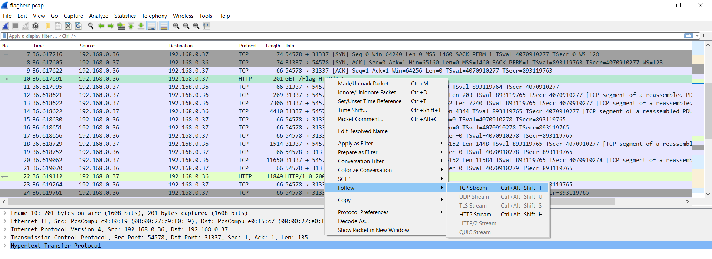

**hack10{p0w3rup\_ur\_p0w3rp01n7}**

**2.3 brokenheart 💔💔**

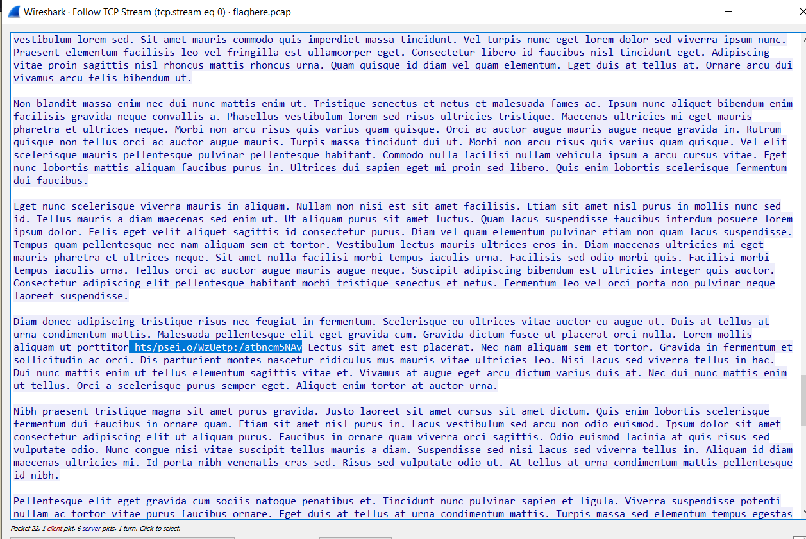

Hint: “143 _**word**_ to open my heart” and “The art of hiding is part of love”

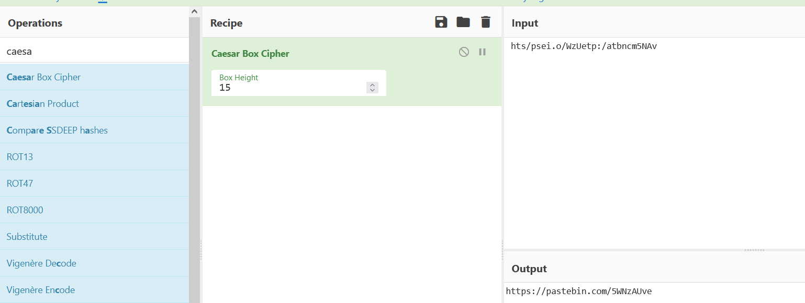

After scanning the QR code, we got ''I Love You'' so that is our secret key, then we use **steghide** because of the hint “The art of hiding is part of love” and yes, we love steganography!

Let’s help him solve his brokenheart issue!\

$ steghide extract -sf brokenheart.jpg

Enter Passphrase: ILoveYou

But the QR code is unlikely to be readable, so we re-draw it using [qrazybox](https://merricx.github.io/qrazybox/)

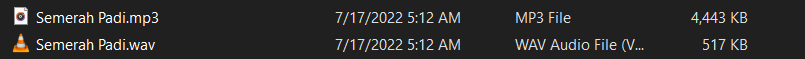

and finally we got a readable QR code! And let’s extract the data from the QR code!!!

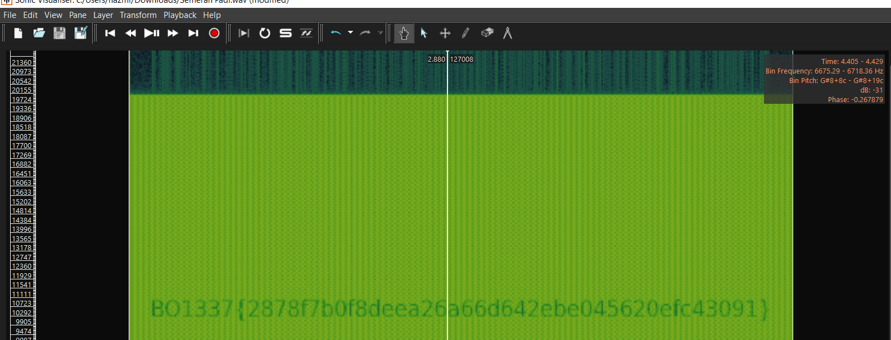

**hack10{br0k3n\_QR\_c4n\_b3\_f1x3d\_n0t\_br0k3nH34rT}**

Legends believe that the author still heart broken 💔

### Steganography 

**3.1 garykessler**

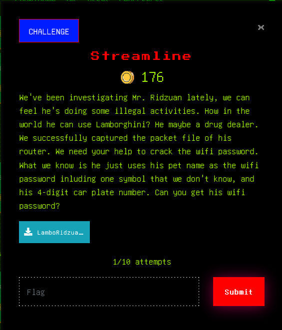

Let’s try binwalk for this picture $ binwalk --dd='.\*' matabatin.jpg

And sheeeeesh! A flag :) **hack10{4s\_aBov3\_5o\_Bel0w}**

**3.2 penat**

For this challenge, we get an mp3 file with scratchy noise. Just use Sonic Visualiser > add Spectrogram > set Window 256

**hack10{1m\_t1R3d\_0f\_Mc0\_jkjk}** Easyyyyyy Peasy!\

### Cryptography 

**4.1 tr1ple T**

Let’s just decode it. It’s a Tic-Tac-Toe! We then proceed to decode the symbols [here](https://www.dcode.fr/tic-tac-toe-cipher)

**hack10{TICKITYTACKITYTOE}**

**4.2 Double P**

From this question, we got PiedPiper jpg file 

Since we didn't know what type of cipher it is, we proceed to reverse search the image using [Yandex](https://yandex.com/images/). From one of the results, we manage to find out that it is a Pig Pen cipher.

Then, we decode the cipher using [dcode.fr](https://www.dcode.fr/pigpen-cipher) and manage to get ‘avadakedavra’ as an output.

As it is not a flag, we tried to extract more data from the original image using binwalk.

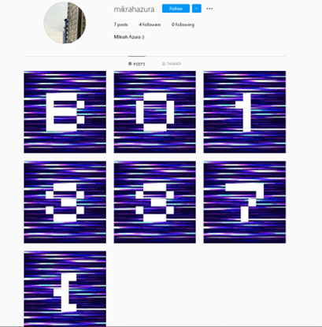

From the extracted data, we got a zip file that requires a password. Proceed to enter ‘avadakedavra’ from the decoded cipher as the password.

And we managed to get the flag file.

**hack10{y0u\_f0uNd\_m3!}**

### Forensics 

**5.1 neighbor**

We got a pcapng file and opened it in wireshark. Filtering with http, we could see that the user was accessing a website at [http://192.168.175.123:9001](http://192.168.175.123:9001).

Right click on one of the packets and click on follow tcp stream, we can see the host and source code of the website the user accessed.

Proceed to save the source code into a file such as neighbour.html and open it one a browser. It seems that the page is not working.

Based on the console error, we need to change the location.origin into an ip address and port such as http://192.168.175.128:9001 .

Open the html file again and we can see a website with a drawing function using the mouse.

Based on the source code, we know that the website was made of html canvas, websocket and nodejs. After learning how to create the page from[ this website ](https://wesbos.com/html5-canvas-websockets-nodejs), we know that the websocket was used to send the coordinate of the user's mouse to the server. By using the ‘websocket’ filter on wireshark, we were able to see the mouse coordinate sent to the websocket server.

From this [writeup](https://www.cyborgsecurity.com/cyborg\_labs/cyborg-security-2020-ctf-solutions/), we learn to dump the websocket data by using [tshark](https://www.wireshark.org/docs/man-pages/tshark.html).

$ tshark -r neighbour.pcapng -Y websocket.payload -E occurrence=l -T fields -e text

Then, we used [this website](https://www.mobilefish.com/services/record\_mouse\_coordinates/record\_mouse\_coordinates.php) to map out the mouse coordinates.

And we got the flag.

**hack10{why\_chu\_spy\_0n\_m3???}**

Credits to write ups and site for idea:

\
[https://ctftime.org/writeup/24540\
](https://ctftime.org/writeup/24540)[https://www.cyborgsecurity.com/cyborg\_labs/cyborg-security-2020-ctf-solutions/](https://www.cyborgsecurity.com/cyborg\_labs/cyborg-security-2020-ctf-solutions/)

[https://wesbos.com/html5-canvas-websockets-nodejs/](https://wesbos.com/html5-canvas-websockets-nodejs/)

[https://www.mobilefish.com/services/record\_mouse\_coordinates/record\_mouse\_coordinates.php](https://www.mobilefish.com/services/record\_mouse\_coordinates/record\_mouse\_coordinates.php)

Arigathanks!💙

**5.2 odyssey-01**

After downloading the Odyssey.ova file, we tried to open it using vmware but failed. Then, we proceed to use Virtual Box Oracle. However, it seems to be stuck at the booting process with multiple errors.

After trying to change the settings of the image file for a couple of hours, we noticed that it uses Genymotion Startup while trying to boot.

After some googling, we found out that we can use Genymotion alongside Virtual Box to boot android devices. We downloaded [Genymotion](https://www.genymotion.com/download/) and registered for the free account. Opening the app, it recognized our already installed Google Pixel XL device from Virtual Box and we just start it to successfully boot it.

After booting, we get a home screen same as most Android devices. We proceed to check the common places such as gallery, audio, and email.

Then proceed to open Amaze application also known as a file manager and saw a file named flag1 in the device directory.

Inside the file we got the flag.

**hack10{Gl4d\_t0\_S33\_yOu\_hEr3}**

**5.3 odyssey-02**

In this challenge, we open the ES Explorer and use the storage analyze feature to check for any weird or recently created file.

From one of the recently created files, we got several redundant flag files.

We noticed the flag069.bin file(nice) and opened it. Inside we get the second flag.

**hack10{W3lc0me\_T0\_m03b1lE\_f0ren5iC}**

**5.4 odyssey-03**

Opening the Messaging app of the device, we get to see several conversations that seem to lead to the third flag.

On the first conversation, we can see the user sent a short url [shorturl.at/josL9](http://shorturl.at/josL9)

Opening the link leads us to a dropbox file that stores a file artifact.docx . It seems blank, we downloaded the file to explore the content of the docx.

We highlighted the whole docx using Ctrl + A and chose the red colour. It seems like someone tried to hide these texts. Although it looks gibberish, we managed to extract a readable flag at the end of some paragraphs and combine it to form a flag.

**hack10{tH3\_unKn0WN\_Of\_ThE\_L0nG\_lO5T\_4RT1f4ct5}**
